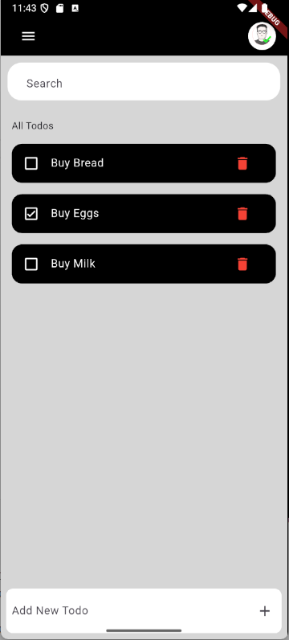
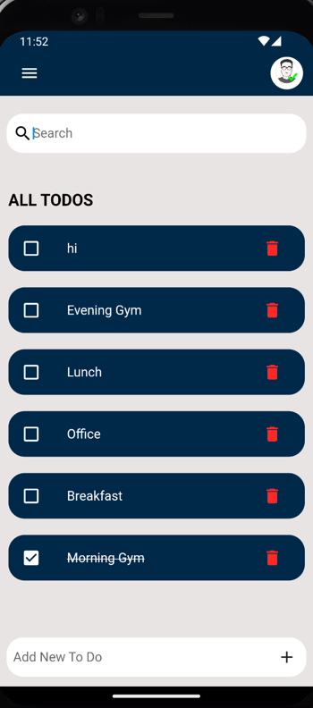
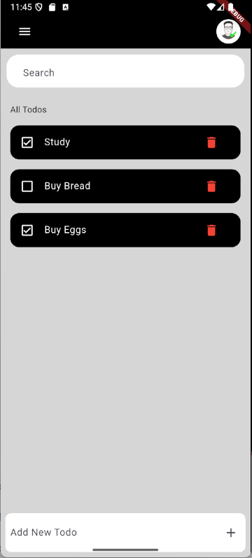

# 📝 Flutter Todo App

A simple yet elegant **Todo List application** built with **Flutter**.  
This app allows users to add, delete, search, and toggle the completion status of tasks.

## 📱 Screenshots

  

## 🚀 Features

- ✅ Add new todos
- ❌ Delete existing todos
- 🔍 Real-time search through todos
- 🗂 Mark todos as done or undone
- 🧼 Clean and minimal UI

## 📦 Project Structure

```
lib/
├── main.dart            # Main app entry point
├── models/
│   └── todo.dart        # Todo model
└── widgets/
    └── todoItem.dart    # UI component for each todo item
assets/
└── profile.png          # Profile avatar (used in AppBar)
```

## 🛠 Getting Started

### ✅ Prerequisites

- Flutter SDK (version >= 3.0.0)
- Android Studio / VS Code
- Dart plugin

### 🚨 Run the App

1. **Clone the repository**
   ```bash
   git clone https://github.com/HasithFernando/ToDo-App.git
   cd todo_app
   ```

2. **Get dependencies**
   ```bash
   flutter pub get
   ```

3. **Run on emulator or real device**
   ```bash
   flutter run
   ```

## 🎨 UI Highlights

- Built using `Material Design`
- Uses `Stack`, `ListView`, `TextField`, `AppBar`, `CircleAvatar`, and more
- Responsive layout

## 📁 Assets

Make sure your `pubspec.yaml` includes:

```yaml
flutter:
  assets:
    - assets/profile.png
```

## 👨‍💻 Author

**Hasith Fernando**  
- GitHub: [HasithFernando](https://github.com/HasithFernando)  
- Email: [hasiththilana@gmail.com](mailto:hasiththilana@gmail.com)

